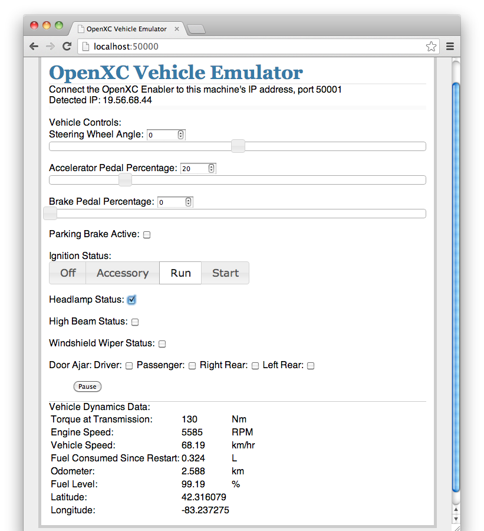

# openxc-vehicle-simulator

## Overview
The OpenXC Vehicle Emulator is a web application intended for developers to run 
on local machines to generate a simulated OpenXC vehicle data trace in real 
time, to be used for testing Android applications.

This is intended to compliment the Enabler's ability to play back a recorded 
trace file.  The Emulator does not attempt to provide a high precision depiction 
of a specific vehicle.  If an app requires a high degree of accuracy, debuging 
should be done with a trace.  The Emulator provides real-time manipulation of 
the data.  This allows the developer to create and change desired conditions in 
real time.

The OpenXC Emulator creates vehicle data in the OpenXC format, emulating data 
that comes from the OpenXC Vehicle Interface.  It emulates all of the signals in 
the 
[official OpenXC signal list](http://openxcplatform.com/vehicle-interface/output-format.html), 
at the listed frequencies.  The emulator also takes user input for the vehicle 
controls.  (Pedals, steering wheel, etc.)  The generated data is displayed for 
the user and sent to the Android host device via TCP connection.  The vehicle 
dynamics model is simple.  It is modular, allowing for different vehicles, but 
for the current version, accuracy is not be a priority. The point is not to 
create data from a specific model and year, but rather to create plausible data 
from a hypothetical car that can be used for debugging and demonstrations.

The user interface is not a driving simulator, merely a list of controls.
Controls include sliders for pedals and the steering wheel, various radio
buttons and switches for other controls, etc.  Vehicle controls include
everything needed to generate the above list of vehicle data, including doors
and lights.  While the fastest OpenXC signal is 60Hz, the physics model iterates
at 100Hz to produce plausible data for things like the torque and engine speed.
The world outside the car is currently assumed to be a flat, featureless sphere,
solely for the purpose of generating GPS data.

The core of the emulator is python running a local web server through
[Flask](http://flask.pocoo.org/docs/installation).  The user interface is
accessed through a web browser pointed at localhost.  The Emulator also listens
for incoming network connections from the OpenXC Enabler, running on an Android
device.

## Installing the Emulator
Once you've cloned the repository, install the Python Flask dependencies with
`pip`:

      $ pip install -r pip-requirements.txt

## Running the Emulator
To run the app:

      $ ./emulate.py

To open the UI, open a browser and navigate to http://localhost:50000/

To connect with an Android device, open the Enabler activity, open the settings,
choose Data Sources, and enable "Use a network device".

Set the host address to the address of the machine running emulate.py, and set
the port to 50001. You may need to disable and re-enable "Use a network device"
after entering the correct information. The terminal running emulate.py should
indicate that it received a new connection.

## Under the Hood
The Emulator is comprised of three main components:  The State Manager, The User 
Interface, and the Dynamics Model.  The Network Connection to the OpenXC Enabler 
makes use of the 
[OpenXC Web API](https://github.com/openxc/web-logging-example#api).

### User Interface

The GUI allows real time user input.  (pedals, gear, steering wheel, etc.)  The 
GUI also displays the outgoing data to the user.  This is not intended to be any 
sort of video game, nor a simulation of the driving experience.  It is only 
intended to simulate the data that might be generated on the CAN bus.  The user 
interface uses [Flask](http://flask.pocoo.org/) and 
[jQuery](http://jqueryui.com/) to provide interaction with the Emulator.  

emulate.py

This is the Python script that sets everything in motion.  It starts the Flask
server, creates the State Manager object, provides data to the UI, and handles
user input.

templates/layout.html

templates/vehicle_controls.html

These provide the html code for the user interface.  They provide the framework
in which the jQuery components work.

static/emulator_scripts.js

This has all the JavaScript code for the UI.  The majority of this file is code
handling the jQuery elemenents.  It also contains the loop that polls the
Dynamics Model for data every second, and displays it.

### State Manager

The Stage Manager keeps track of the simulation’s current state, and handles
sending that information to the TCP connection, the GUI, and the Dynamics Model.
The State Manager does not regulate data internal to the Dynamics Model.  (Air
drag, road friction, etc.)  Nor will it be updated as fast.

state_manager.py

The State Manager object receives incoming user input, monitors the dynamics
model, and sends data to any connected Enablers.  It creates and stores the
Dynamics Model object and Enabler Connection object.  It creates and maintains
the loops that send the regular data to the Enabler.

enabler_connection.py

The Enabler Connection object runs a loop that listens for incoming connections
from Android devices running the OpenXC Enabler.  It also provides the routines
for moving data from the State Manager to the Enablers.

### Dynamics Model

The Dynamics Model iterates at 100Hz.  Data is kept in the Physics Model with a
higher precision than is used in the CAN traffic.  (This will help reproduce
conditions that have created failures in vehicles, but did not fail with the
current emulator.)

dynamics_model.py

This object initializes all the simulation data, and maintains the current
state.  The 100HZ iterate loop calls the Iterate() functions for each of the
data points.

data/data_calc.py

This is the base class for each of the data types in the Dynamics Model.  Each
data type in that directory overloads the iterate() function with the proper way
to reach the next snapshot of that data.

## License

Copyright (c) 2011-2013 Ford Motor Company

Licensed under the BSD license.